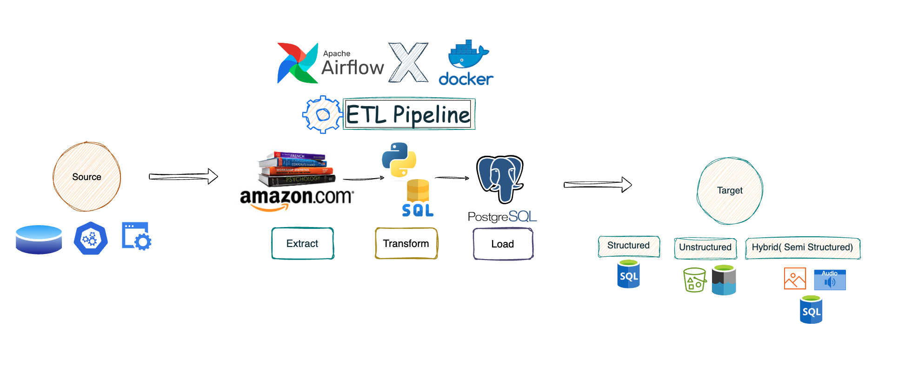

# Amazon Books Data Pipeline

An Airflow ETL project that extracts Amazon book search results, transforms text fields into analysis-ready columns, and loads the data into PostgreSQL for SQL analysis.



## What This Project Shows

- Airflow DAG orchestration with extract, transform, load, quality check, and analytics-view tasks.
- Docker Compose based local stack with Airflow, PostgreSQL, Redis, Celery worker, and pgAdmin.
- Web scraping with `requests` and `BeautifulSoup`.
- Data cleaning with parsed numeric price and rating columns.
- Idempotent PostgreSQL loading with `ON CONFLICT` upserts.
- SQL queries for data validation, profiling, and business-style analysis.

## Project Structure

```text
.
├── dags/
│   ├── app.py                         # Airflow DAG orchestration
│   └── amazon_books_pipeline/
│       ├── config.py                  # Shared constants and XCom keys
│       ├── extract.py                 # Amazon scraping logic
│       ├── transform.py               # Deduplication and data cleaning
│       ├── load.py                    # PostgreSQL upsert logic
│       └── sql_queries.py             # DDL, DQ, and analytics SQL
├── docs/
│   └── interview_notes.md             # Short prep notes and talking points
├── images/
│   └── pipeline_design.png            # Architecture diagram
├── sql/
│   ├── 01_schema_and_quality.sql      # Table, indexes, views, and DQ checks
│   └── 02_interview_analysis_queries.sql
├── docker-compose.yaml                # Local Airflow stack
├── requirements.txt                   # Python dependencies used during local development
└── .env.example                       # Local Airflow environment example
```

## Pipeline Flow

1. `extract_book_data` scrapes raw Amazon search result fields.
2. `transform_book_data` deduplicates by title and parses:
   - `price_amount` from price text.
   - `rating_value` from rating text.
   - `scraped_at` and `source_url` metadata.
3. `create_table` creates or upgrades the `books` table and indexes.
4. `load_book_data` upserts rows into PostgreSQL so repeated DAG runs do not duplicate books.
5. `data_quality_check` fails the DAG if the target table is empty or contains duplicate titles.
6. `create_analytics_views` creates reporting views for quick SQL demos.

## Run Locally

Create an optional `.env` file:

```bash
cp .env.example .env
```

Start Airflow:

```bash
docker compose up airflow-init
docker compose up
```

Open the services:

- Airflow UI: `http://localhost:8080`
- pgAdmin: `http://localhost:5050`
- PostgreSQL host: `localhost`
- PostgreSQL port: `5432`
- PostgreSQL database/user/password: `airflow` / `airflow` / `airflow`

In Airflow, create a PostgreSQL connection:

```text
Connection Id: books_connection
Connection Type: Postgres
Host: postgres
Schema: airflow
Login: airflow
Password: airflow
Port: 5432
```

Then unpause and trigger the DAG named `fetch_and_store_amazon_books`.

## SQL Demo

After a DAG run, open pgAdmin and run:

```sql
SELECT * FROM book_catalog_metrics;
SELECT * FROM top_rated_affordable_books;
```

For a stronger interview demo, use the ready-made queries in:

- `sql/01_schema_and_quality.sql`
- `sql/02_interview_analysis_queries.sql`
- `sql/03_data_quality_checks.sql`

## Interview Assets

- `docs/interview_notes.md`: short answers and project pitch.
- `docs/demo_walkthrough.md`: step-by-step demo flow.
- `docs/data_contract.md`: table contract and quality rules.
- `docs/future_enhancements.md`: realistic production next steps.

## Interview Pitch

This project is a small but complete batch ETL pipeline. Airflow schedules and monitors the workflow, Python extracts and cleans semi-structured HTML data, and PostgreSQL stores curated records for analysis. I improved the original pipeline by splitting extract, transform, and load into separate modules, then adding idempotent upserts, typed analytical columns, metadata, quality checks, indexes, and reusable SQL views.

## Original Learning Reference

Video walkthrough used by the original project:

https://www.youtube.com/watch?v=3xyoM28B40Y
