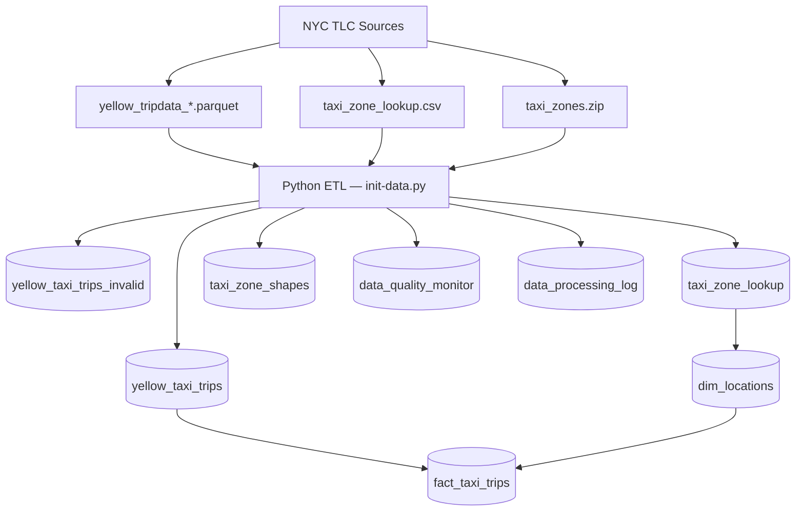

# SQL Analytics Lab — NYC Taxi Data

A production-style PostgreSQL analytics environment built on real NYC Yellow Taxi trip data.
Demonstrates end-to-end data engineering: schema design, ETL pipelines, star schema modeling,
query optimization, and BI dashboards — all containerized and reproducible.

**Stack:** PostgreSQL 17 · PostGIS 3.5 · Apache Superset · PGAdmin 4 · Docker · Python

---

## What's Inside

| Area | Details |
|---|---|
| **Dataset** | NYC TLC Yellow Taxi records — 3–5 million rows/month, 2009–2025 |
| **Schema** | Normalized OLTP schema + star schema (fact + 6 dimension tables) |
| **ETL** | SHA-256 hash deduplication, chunked loading, resume-safe backfill |
| **Analytics** | 13 optimized SQL queries with before/after comparisons |
| **Performance** | Materialized views, composite indexes, parallel query tuning |
| **BI** | Apache Superset dashboards connected to live PostgreSQL data |
| **Tests** | pytest suite for data loading and Docker setup validation |

---

## Quick Start

```bash
# 1. Configure environment
cp env .env

# 2. Start all services (PostgreSQL + PGAdmin + Superset)
./start.sh
```

The startup script detects port conflicts and falls back automatically:

| Service | Default | Fallbacks |
|---|---|---|
| PostgreSQL | 5432 | 5433, 5434 |
| PGAdmin | 8080 | 8081, 8082 |
| Superset | 8088 | 8089, 8090 |

Data loads automatically on first start. Default: last 12 months (~40M rows).
Monitor progress: `docker logs -f sql-playground-postgres`

**Access:**
- PGAdmin: http://localhost:8080 · `admin@admin.com` / `admin123`
- Superset: http://localhost:8088 · `admin` / `admin123`
- PostgreSQL direct: host `postgres`, port `5432`, db `playground`, schema `nyc_taxi`

### Backfill Options

```bash
# In .env — choose how much data to load
BACKFILL_MONTHS=last_12_months   # default
BACKFILL_MONTHS=2024-01,2024-02  # specific months
BACKFILL_MONTHS=all              # full 2009–2025 history
```

---

## Project Structure

```
sql-analytics-lab/
├── docker-compose.yml
├── start.sh
├── env
├── postgres/
│   ├── docker/
│   │   ├── Dockerfile.postgres        # PostgreSQL 17 + PostGIS + Python
│   │   └── init-data.py               # ETL pipeline & backfill system
│   ├── sql-scripts/
│   │   ├── init-scripts/
│   │   │   ├── 00-postgis-setup.sql   # PostGIS extensions
│   │   │   ├── 01-nyc-taxi-schema.sql # Main schema + indexes
│   │   │   └── 02-materialized-views.sql
│   │   ├── model-scripts/
│   │   │   ├── 01-phase1-star-schema.sql
│   │   │   └── 04-data-migration.sql
│   │   └── report-scripts/
│   │       ├── nyc-taxi-analytics.sql
│   │       └── sample-queries.sql
├── superset/
│   ├── config/superset_config.py
│   └── docker/
├── tests/
│   ├── test_data_loading.py
│   └── test_docker_setup.py
└── docs/
```

---

## Database Schema

### Normalized (OLTP)

**`nyc_taxi.yellow_taxi_trips`** — main fact table, 21 columns

| Column | Type | Notes |
|---|---|---|
| `row_hash` | VARCHAR(64) PK | SHA-256 of all columns — prevents duplicates |
| `tpep_pickup_datetime` | TIMESTAMP | Partitioned on this column |
| `pulocationid` / `dolocationid` | INTEGER | FK → taxi_zone_lookup |
| `fare_amount`, `tip_amount`, `total_amount` | DECIMAL | Financial measures |
| `trip_distance`, `passenger_count` | DECIMAL/INTEGER | Trip metrics |

Supporting tables: `taxi_zone_lookup` (263 NYC zones), `taxi_zone_shapes` (PostGIS geometries),
`vendor_lookup`, `payment_type_lookup`, `rate_code_lookup`

### Star Schema (OLAP)

```
fact_taxi_trips
    ├── dim_date         (date_key, year, quarter, month, is_weekend, is_holiday)
    ├── dim_time         (time_key, hour_24, is_rush_hour, time_period)
    ├── dim_locations    (location_key, zone, borough, is_airport)
    ├── dim_vendor       (vendor_key, vendor_name, is_active)
    ├── dim_payment_type (payment_type_key, description, allows_tips)
    └── dim_rate_code    (rate_code_key, description, is_metered)
```

Star schema built via `01-phase1-star-schema.sql` and populated by `04-data-migration.sql`
which includes bulk migration, incremental loading, and rollback capability.

---

## ETL Pipeline

The `init-data.py` script manages the full pipeline:

1. Wait for PostgreSQL readiness
2. Run schema scripts (`IF NOT EXISTS` — safe for restarts)
3. Download and load 263 NYC taxi zones + PostGIS shapefiles
4. Download trip parquet files from NYC TLC (configured month range)
5. Deduplicate with SHA-256 row hashing
6. Load in 100K-row chunks with error classification
7. Populate star schema with cached dimension lookups
8. Refresh materialized views
9. Verify row counts post-load

### Duplicate Prevention

```python
def calculate_row_hash(row):
    row_dict = {}
    for column, value in row.items():
        if pd.isna(value):
            row_dict[column] = ""
        elif isinstance(value, float):
            row_dict[column] = f"{value:.10f}"   # consistent float precision
        else:
            row_dict[column] = str(value)
    row_json = json.dumps(row_dict, sort_keys=True)
    return hashlib.sha256(row_json.encode('utf-8')).hexdigest()
```

```sql
INSERT INTO nyc_taxi.yellow_taxi_trips (...)
VALUES (...)
ON CONFLICT (row_hash) DO NOTHING;
```

### Resume Capability

The pipeline tracks processed months in `data_processing_log`. On restart it skips completed
months and resumes from the interruption point — no re-downloading, no duplicates.

```
2024-11: Already processed (3,646,369 records) ✅ Skipped
2024-12: Already processed (3,668,371 records) ✅ Skipped
2025-01: Previous processing incomplete, retrying...
```

---

## Performance

### Indexes

The `yellow_taxi_trips` table carries 13 indexes totaling more storage than the data itself:

| Index | Size | Purpose |
|---|---|---|
| `yellow_taxi_trips_pkey` (row_hash) | 3.9 GB | SHA-256 deduplication |
| `idx_yellow_taxi_location_datetime` | 1.5 GB | Location + time range queries |
| `idx_yellow_taxi_datetime_vendor` | 990 MB | Time + vendor queries |
| `idx_yellow_taxi_total_amount` | 696 MB | Revenue sorting (12ms vs ~2s) |
| `idx_yellow_taxi_pickup_datetime` | 689 MB | Time-series, hourly analysis |

This tradeoff — 1.6× index-to-data ratio — makes reads milliseconds-fast for a
playground that loads data once and queries frequently.

### Materialized Views

Three pre-aggregated views compress 32M rows for near-instant analytical queries:

| View | Source Rows | Materialized Rows | Compression |
|---|---|---|---|
| `trip_hourly_summary` | ~32M | ~25K | 1,280× |
| `trip_location_summary` | ~32M | ~121K | 264× |
| `trip_distance_summary` | ~32M | 6 | 5,300,000× |

| Query | Raw table | Materialized view | Speedup |
|---|---|---|---|
| Cross-borough analysis | 1.78s | 32ms | **56×** |
| Distance distribution | 2.22s | 0.07ms | **31,700×** |
| Weekend vs weekday | 1.5s | 5ms | **300×** |
| Payment method breakdown | 1.5s | 4ms | **380×** |

### PostgreSQL Tuning

Default PostgreSQL ships tuned for a 512MB server from 2005. The container overrides:

| Setting | Default | Configured | Effect |
|---|---|---|---|
| `shared_buffers` | 128 MB | **8 GB** | Hot pages stay in RAM |
| `work_mem` | 4 MB | **256 MB** | Eliminates disk spills on sorts |
| `effective_cache_size` | 4 GB | **24 GB** | Planner prefers index scans |
| `max_parallel_workers_per_gather` | 2 | **16** | Full-table scans split across 16 cores |

Result: a query that previously ran at 6.9s with 2 workers spilling 267MB to disk
now runs in under 1 second using 16 workers with in-memory aggregation.

---

## Sample Queries

### Window Functions — Top Zones by Borough Revenue

```sql
WITH zone_revenue AS (
    SELECT
        tzl.borough,
        tzl.zone,
        SUM(yt.total_amount)                                          AS total_revenue,
        COUNT(*)                                                       AS trip_count
    FROM nyc_taxi.yellow_taxi_trips yt
    JOIN nyc_taxi.taxi_zone_lookup tzl ON yt.pulocationid = tzl.locationid
    WHERE yt.total_amount > 0
    GROUP BY tzl.borough, tzl.zone
),
ranked AS (
    SELECT *,
        ROW_NUMBER() OVER (PARTITION BY borough ORDER BY total_revenue DESC) AS revenue_rank,
        ROUND(100.0 * total_revenue / SUM(total_revenue) OVER (PARTITION BY borough), 2)
            AS pct_of_borough
    FROM zone_revenue
)
SELECT borough, zone, revenue_rank, total_revenue, trip_count, pct_of_borough
FROM ranked
WHERE revenue_rank <= 3
ORDER BY borough, revenue_rank;
```

### Time Series — Anomaly Detection with Rolling Stats

```sql
WITH daily AS (
    SELECT
        DATE(tpep_pickup_datetime)           AS trip_date,
        COUNT(*)                             AS daily_trips
    FROM nyc_taxi.yellow_taxi_trips
    WHERE tpep_pickup_datetime >= CURRENT_DATE - INTERVAL '90 days'
    GROUP BY 1
),
rolling AS (
    SELECT *,
        AVG(daily_trips)    OVER (ORDER BY trip_date ROWS BETWEEN 29 PRECEDING AND CURRENT ROW)
            AS rolling_avg_30d,
        STDDEV(daily_trips) OVER (ORDER BY trip_date ROWS BETWEEN 29 PRECEDING AND CURRENT ROW)
            AS rolling_stddev_30d
    FROM daily
)
SELECT
    trip_date,
    daily_trips,
    ROUND(ABS(daily_trips - rolling_avg_30d) / NULLIF(rolling_stddev_30d, 0), 2) AS z_score,
    CASE
        WHEN ABS(daily_trips - rolling_avg_30d) > 2 * rolling_stddev_30d THEN 'ANOMALY'
        WHEN ABS(daily_trips - rolling_avg_30d) > 1.5 * rolling_stddev_30d THEN 'UNUSUAL'
        ELSE 'NORMAL'
    END AS flag
FROM rolling
WHERE rolling_stddev_30d IS NOT NULL
ORDER BY trip_date DESC;
```

### Optimization Pattern — Pre-Aggregate Before Joining

```sql
-- Pre-aggregate by raw IDs first, then join lookup tables for labels.
-- Hash join operates on ~43K groups instead of 11M rows → ~37% faster.

SELECT
    pz.borough || ' -> ' || dz.borough AS route,
    SUM(agg.trip_count)                AS trip_count,
    SUM(agg.avg_fare * agg.trip_count) / SUM(agg.trip_count) AS avg_fare
FROM (
    SELECT pulocationid, dolocationid, COUNT(*) AS trip_count, AVG(fare_amount) AS avg_fare
    FROM nyc_taxi.yellow_taxi_trips
    GROUP BY pulocationid, dolocationid
) agg
JOIN nyc_taxi.taxi_zone_lookup pz ON agg.pulocationid = pz.locationid
JOIN nyc_taxi.taxi_zone_lookup dz ON agg.dolocationid = dz.locationid
GROUP BY pz.borough, dz.borough
ORDER BY trip_count DESC;
```

### Data Quality — Comprehensive Anomaly Report

```sql
WITH checks AS (
    SELECT
        COUNT(*)                                                                    AS total,
        COUNT(*) FILTER (WHERE tpep_pickup_datetime > tpep_dropoff_datetime)        AS negative_duration,
        COUNT(*) FILTER (WHERE trip_distance = 0)                                   AS zero_distance,
        COUNT(*) FILTER (WHERE total_amount <= 0)                                   AS invalid_fare,
        COUNT(*) FILTER (WHERE passenger_count = 0)                                 AS zero_passengers,
        COUNT(*) FILTER (WHERE total_amount > 1000)                                 AS extreme_fares,
        COUNT(*) FILTER (WHERE payment_type = 2 AND tip_amount > 0)                 AS cash_with_tip
    FROM nyc_taxi.yellow_taxi_trips
    WHERE tpep_pickup_datetime >= CURRENT_DATE - INTERVAL '30 days'
)
SELECT
    unnest(ARRAY[
        'Negative duration trips', 'Zero distance trips',
        'Invalid fares', 'Zero passenger trips',
        'Extreme fares (>$1000)', 'Cash trips with tips'
    ]) AS check_name,
    unnest(ARRAY[
        negative_duration, zero_distance, invalid_fare,
        zero_passengers, extreme_fares, cash_with_tip
    ]) AS count,
    unnest(ARRAY[
        CASE WHEN negative_duration = 0 THEN 'PASS' ELSE 'FAIL' END,
        CASE WHEN zero_distance < total * 0.01 THEN 'PASS' ELSE 'WARN' END,
        CASE WHEN invalid_fare = 0 THEN 'PASS' ELSE 'FAIL' END,
        CASE WHEN zero_passengers < total * 0.01 THEN 'PASS' ELSE 'WARN' END,
        CASE WHEN extreme_fares <= 10 THEN 'PASS' ELSE 'WARN' END,
        'INFO'
    ]) AS status
FROM checks;
```

---

## Data Pipeline Architecture



---

## Apache Superset BI

Superset is pre-configured with a live connection to the `playground` database.

**SQL Lab** — autocomplete, query history, one-click chart creation from results

**Dashboard ideas:**
- Geographic heatmap of pickup/dropoff zones across boroughs
- Time-series revenue trends with payment method breakdown
- Rush hour vs off-peak performance comparison
- Cross-borough flow analysis with trip counts and avg fares

Dashboards and charts persist across restarts (SQLite metadata backend, no Redis required).

---

## Configuration

```env
# .env
POSTGRES_DB=playground
POSTGRES_USER=admin
POSTGRES_PASSWORD=admin123
POSTGRES_PORT=5432

PGADMIN_EMAIL=admin@admin.com
PGADMIN_PASSWORD=admin123
PGADMIN_PORT=8080

SUPERSET_PORT=8088
SUPERSET_ADMIN_USER=admin
SUPERSET_ADMIN_PASSWORD=admin123

BACKFILL_MONTHS=last_12_months   # last_12_months | last_6_months | 2024-01,2024-02 | all
DATA_CHUNK_SIZE=100000
```

**System requirements:** Docker + Docker Compose, 4GB+ RAM, ~2GB free disk per year of data loaded.

```bash
# Useful commands
docker logs -f sql-playground-postgres          # monitor ETL progress
docker exec -it sql-playground-postgres psql -U admin -d playground

# Check loaded data
SELECT data_year, data_month, status, total_records_loaded
FROM nyc_taxi.data_processing_log ORDER BY data_year, data_month;

# Refresh materialized views after loading new months
REFRESH MATERIALIZED VIEW CONCURRENTLY nyc_taxi.trip_hourly_summary;
REFRESH MATERIALIZED VIEW CONCURRENTLY nyc_taxi.trip_location_summary;
REFRESH MATERIALIZED VIEW CONCURRENTLY nyc_taxi.trip_distance_summary;

# Full reset
docker-compose down -v && docker-compose up -d --build
```

---

## Data Source

NYC Yellow Taxi trip records from the [NYC Taxi & Limousine Commission](https://www.nyc.gov/site/tlc/about/tlc-trip-record-data.page).
Downloaded automatically from official parquet files. All 263 taxi zone boundaries
sourced from official TLC shapefiles and stored as PostGIS geometries (EPSG:2263).